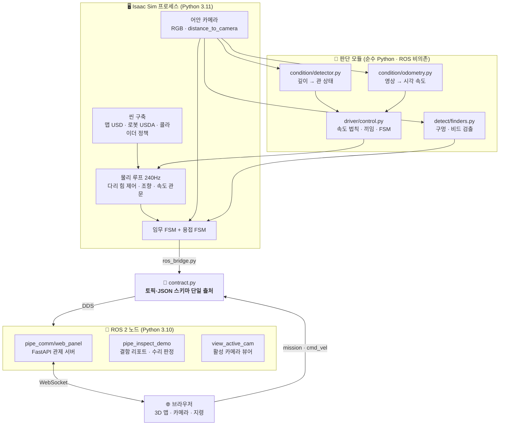
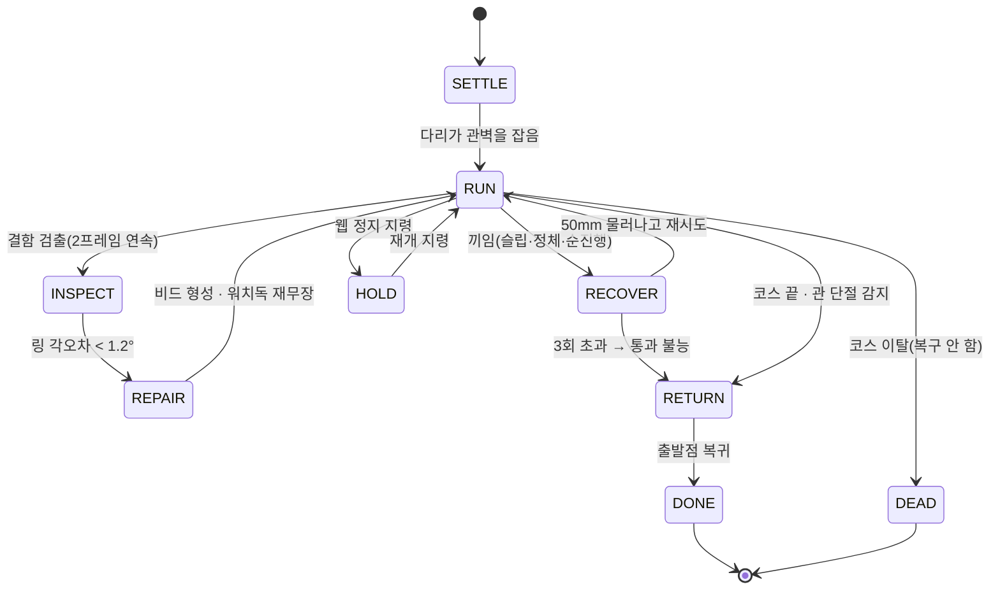
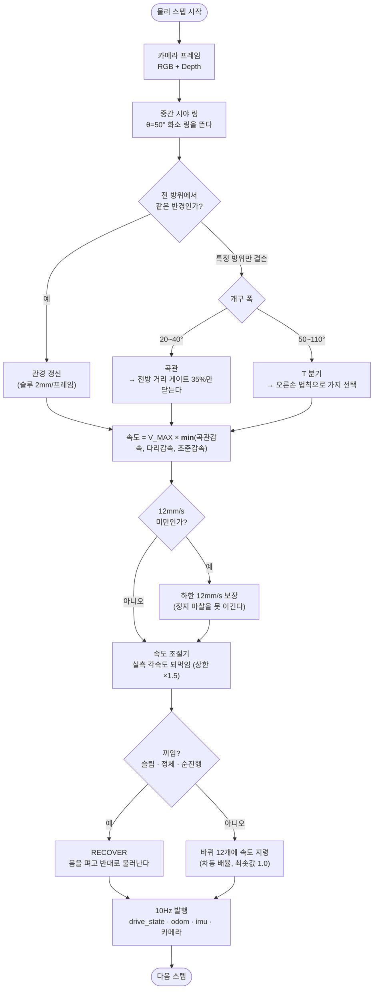
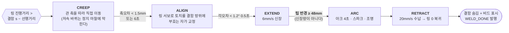
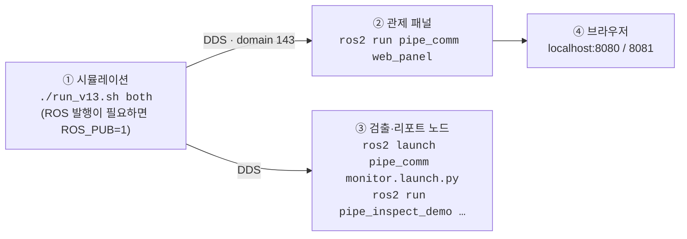

# 🤖 배관 점검·수리 로봇 (ROS 2 Humble + NVIDIA Isaac Sim)

건물 배관 **내부를 주행하며 결함을 찾아 용접으로 수리**하는 로봇을,
NVIDIA Isaac Sim 디지털 트윈으로 구현·검증한 프로젝트다.
실제 2층 화장실 배관망(CAD) 안에서 로봇 2대가 **각자의 층을 동시에** 임무 수행하고,
그 상태를 ROS 2 로 내보내 브라우저 관제 화면에서 지켜보며 조종한다.

```
샤워 배수구 진입 → 관내 자율주행 → T 분기 판단 → 결함 검출
      → 토치 정렬·아크 용접 → 수리 검증 → 복귀
```

---

## 📌 주요 기능 (Key Features)

### 1. 관내 자율주행 — 조향 바퀴가 없는 로봇을 모는 법

- **제어 입력이 전진 속도 하나뿐이다.** 조향 바퀴가 없고 관절은 자세 정렬에 쓰므로,
  횡방향은 12개 바퀴가 관벽을 밀며 기계적으로 잡는다.
- **감속 인자를 곱하지 않고 `min` 으로 고른다.** 곱하면 두 조건이 동시에 걸릴 때
  0.45 × 0.45 = 0.20 으로 과도하게 죽어 정지 마찰을 못 이긴다.
- **가속은 완만(0.08 m/s²)·감속은 급(0.40 m/s²)** — 비대칭이 의도적이다. 정지가 늦으면 안 된다.
- **속도 유지 조절기(Governor)**: 속도 드라이브의 힘은 `댐핑 × (지령 − 실제)` 라
  부하가 걸리면 실제 각속도가 지령의 93% 자리에서 평형을 잡는다. 실측 각속도
  되먹임으로 배율을 올린다(상한 1.5배 — 접촉 감지폭을 넘으면 바퀴가 관벽을 뛰어넘는다).

### 2. 중간 시야 링 — 측정 장치 하나로 관경과 분기를 동시에 잰다

어안 카메라의 등거리 규약(화면 반경 `ρ = f·θ`)에서 **광축과 θ=50° 를 이루는 화소 링**을 뜬다.
그 방향 광선이 관벽을 거리 `d` 에서 만나면 관 내반경은 `R = d·sinθ` 로 바로 나온다.

| 링이 보는 것 | 뜻 |
|---|---|
| 전 방위에서 같은 `R` | 그 `R` 이 지금 관의 반경 (**관경 측정**) |
| 특정 방위에서만 벽이 사라짐 | 그 방위가 분기 개구의 방향과 폭 (**분기 검출**) |

- **개구의 "폭"이 곡관과 T 를 가른다** — 실측 수십 프레임에서 곡관은 20~40°,
  T 는 50~110° 로 **겹침이 0** 이었다. 문턱 45°.
- **기준 관경은 상수가 아니라 추적값이다** — 확관·리듀서가 있으므로 DN100 에 묶지 않고
  프레임당 2mm 슬루 제한으로 따라간다.

### 3. 시각 오도메트리 — 바퀴가 헛돌아도 진짜 전진량을 안다

- **특징점 추적(Lucas-Kanade)을 기각했다.** 25mm 앞 관벽 패치는 프레임 사이에
  평행이동하는 게 아니라 **늘어난다** — 예측 변위의 17%밖에 못 쫓았다.
- **직접 정합으로 바꿨다.** 자유도가 전진 하나뿐이므로 후보 Δz 마다 화면을 재투영해
  ZNCC 를 비교한다. 스케일 변화가 모델 안에 들어 있어 문제가 사라진다. **오차 ±0.25mm.**
- 거리 적산은 **`min(|영상|, |휠|)`** — 관 안에서 몸은 바퀴 표면 속도보다 빨리 갈 수 없다.
  단 저속(휠 < 20mm/s)에서는 광류가 0 을 읽으므로 **휠의 40% 를 바닥**으로 준다.

### 4. 끼임 판정과 회복 — 세 갈래로 잡고, 방향을 상대화해 빠져나온다

| 판정 | 잡는 것 |
|---|---|
| 슬립 | 바퀴는 도는데 실제 속도가 30% 미만, 1.5초 연속 |
| 정체 | 속도 지령이 충분한데 **바퀴가 아예 안 돎** (슬립비가 1.0 으로 위장된다) |
| 순진행 감시 | 복귀 한정 안전망 — 2.5초에 5mm 도 못 갔으면 끼임 |

- **물러나는 방향은 진행 방향에 상대적**이다. 전진 중 끼임은 뒤로, **복귀 중 끼임은 앞으로**.
  규칙을 문자 그대로 "후진 재시도"로 구현하면 복귀 중에 더 깊이 박힌다.
- **회복 중에는 몸을 편다.** 진입 기동의 40° 굽힘을 유지한 채 흔들면 모서리에서
  양방향 모두 쐐기가 되어 영영 못 나온다.
- 3회를 넘으면 그 자리를 통과 불능으로 결론짓고 복귀로 전환한다.

### 5. 용접 수리 — 제자리에서는 보이지 않는 곳을 지진다

- **토치는 본체를 감싸는 회전 링에 달린다.** 바퀴는 전·후진만 되고 관절은 자세용이라
  로봇을 결함 방향으로 돌릴 수단이 없다. 대신 링이 돌아 토치를 겨눈다.
- 🔑 **정지 기준을 머리가 아니라 "링 위치"로 잡는다.** 링은 몸통에 있어 머리보다 뒤다.
  머리를 기준으로 세우면 토치가 결함 **뒤**를 지진다.
- 🚨 **중심선 진행거리 `s` 는 표본 간격 13mm 로 양자화**되어 미세 정렬이 원리적으로
  수렴하지 않았다 → 축 오차를 **결함 지점의 접선에 투영**해 연속값으로 잰다.
- **신장 종료 판정은 신장량이 아니라 팁의 실제 반경**이다 — 팁이 정지 상태에서 이미
  축반경 41mm 에 있으므로, 관벽 50 − 간극 2 = **48mm** 에서 멈춘다(관통 사고 수정).

### 6. 3겹 검증 — "안 보이니까 수리됨" 을 막는다

"검출기가 못 찾음 = 성공" 은 조명·각도로 놓쳐도 성공이 되므로 **AND 로 세 겹**을 건다.

| 겹 | 막는 것 |
|---|---|
| ① 정렬 오차 (1.5mm) | 무조건 성공 = 자기충족 |
| ② **Depth 프로파일** | 검출기의 거짓 음성 |
| ③ 검출기 반전(전 검출 → 후 미검출) | 애초에 대상이 아니었던 것 |

- **비드는 화면을 가리는 게 아니라 형상을 바꾼다.** 색상 덮어쓰기를 배제한 이유가 그것 —
  Depth 는 여전히 홈을 읽어 "안 보이는데 파여 있는" 모순이 생긴다.
- 🚨 **프로파일 판정에 분위수를 쓰면 안 된다.** 99분위로 재니 2.2mm 파인 크랙이
  +0.00mm 로 나왔다 — 폭 1.6mm 크랙은 80×80 창의 상위 1%(64화소)에 완전히 묻힌다.
  → **중앙값 필터(3×3) + 최댓값**, 단 일정 면적 이상 이어질 때만 결함으로 친다.

### 7. 웹 관제 — 브라우저에서 보고 조종한다

- 로봇 **2대를 네임스페이스(`/floor1`, `/floor2`)로 분리**해 동시에 발행·구독한다.
- 3D 배관 맵(CAD 메시 + 중심선 튜브) 위에 현재 위치·지나온 구간·결함을 겹쳐 그린다.
- 🚨 **층이 다르면 월드 좌표 프레임도 다르다**(floor1 과 floor2 가 2.49m 어긋난다).
  각 로봇의 z 오프셋을 실어 보내 한 좌표계에 겹친다.
- 버튼으로 `start / stop / resume / estop` 지령을 보내면 그 로봇이 실제로 반응한다.

---

## 🛠 시스템 설계 (System Architecture)

### 전체 구조

시스템은 **시뮬레이션(Isaac) · 통신 규약 · 관제(ROS·웹)** 세 층이다.
Isaac 쪽은 Python 3.11, ROS 노드 쪽은 3.10 이라 서로의 라이브러리를 못 읽는다 —
그래서 **둘을 잇는 것은 오직 DDS 토픽**이고, 규약을 `contract.py` 한 파일에 못박았다.



> 🔑 **원칙: 규약과 판단은 별도 모듈, 물리와 임무는 시연 파일.**
> 그래서 시연 파일이 커진 대신, 규약을 고치지 않고 세 사람의 코드가 붙는다.

### 임무 상태 기계 (Mission FSM)



### 주행 한 스텝의 판단 흐름 (Logic Flow)

> 아래는 **자율주행 경로(`NAV=vision`)** 다 — 카메라 깊이만으로 조향·감속·분기를 정한다.
> 시연 기본값은 중심선을 아는 `NAV=blueprint` 이므로, 자율주행 성능 수치는
> 반드시 `NAV=vision` 런의 로그에서 인용할 것.



### 용접 시퀀스 (Weld FSM)



### 디렉터리 구조

```
.
├── README.md                  ← 이 문서
├── requirements.txt
├── web/                       🌐 관제 패널 웹 소스 (three.js 벤더 사본 포함, CDN 의존 없음)
└── src/
    ├── son/                   🖥 Isaac Sim 시뮬레이션 본체 — 물리·임무·용접
    │   ├── real_map_demo_v1_3.py   ★ 메인 실행 파일 (5,677행)
    │   ├── run_v13.sh              ★ 실행 스크립트 (검증 레시피 내장)
    │   ├── robot/                  로봇 자산 (pipe_robot_v11_weld.usda)
    │   ├── maps/                   배관망 CAD 맵 (restroom_final0807)
    │   ├── condition/ driver/ localization/   자율주행 판단 모듈 + ROS 노드
    │   ├── welder/ defect/ camera/            용접 검증 · 결함 검출 · 카메라 자산
    │   └── test_code/              오프라인 검증 시험
    ├── dongmin/               🔌 ROS 2 통신 규약 + 웹 관제
    │   ├── pipe_comm/              ROS 2 패키지 (ament_python)
    │   └── isaac_bridge/           Isaac(3.11) 쪽 발행자
    └── dongyeon/              🧠 결함 검출 · 리포트 · 수리 판정
        ├── pipe_inspect_demo/      ROS 2 패키지 (ament_python)
        └── detect/finders.py       OpenCV 구멍·비드 검출 (시연이 직접 로드)
```

각 파트의 상세는 **`src/son/README.md`**, **`src/dongmin/README.md`**,
**`src/dongyeon/README.md`** 를 볼 것.

---

## 💻 개발 환경 (Environment)

| 항목 | 값 |
|---|---|
| **OS** | Ubuntu 22.04 LTS (Jammy Jellyfish) |
| **Middleware** | ROS 2 Humble Hawksbill |
| **Simulator** | NVIDIA Isaac Sim **5.1** |
| **Language** | Python **3.11** (Isaac 내장) / Python **3.10** (시스템 ROS) |
| **DDS** | Fast DDS (`rmw_fastrtps_cpp`), `ROS_DOMAIN_ID=143` |
| **주요 라이브러리** | `numpy`, `opencv-python`, `pxr`(USD), `omni`/`isaacsim`, `rclpy`, `fastapi`, `uvicorn` |

> 🚨 **인터프리터가 둘로 갈린다.** Isaac Sim 5.1 은 Python 3.11 전용이고 ROS 2 Humble 은
> 시스템 3.10 이다. 확장 모듈 ABI 가 달라 서로의 라이브러리를 못 읽는다.
> **Isaac 을 띄우는 터미널에서 `source /opt/ros/humble/setup.bash` 를 하면 안 된다** —
> 3.10 라이브러리가 앞에 잡혀 심볼이 충돌한다.
> 대신 Isaac 내장 rclpy(`isaacsim.ros2.bridge/humble`)를 쓰며, `run_v13.sh` 가 자동으로 잡는다.
> 각 파일 맨 위의 `pyver.py` 가드가 잘못된 인터프리터를 **즉시 중단**시킨다.

---

## ⚙️ 사용 장비 (Hardware Setup)

**시연은 PC 한 대에서 Isaac Sim 과 ROS 노드를 같이 돌린다** — 같은 PC 안이라
DDS 가 루프백으로 통해 멀티캐스트·NAT 문제가 없다.

| 항목 | 사양 |
|---|---|
| 시연 PC | MSI 노트북 / NVIDIA GeForce **RTX 5080** |
| GPU 요구 | Isaac Sim 5.1 RTX 렌더러 + PhysX (GPU 가속 필수) |

로봇·센서는 **전부 시뮬레이션 자산**이며 실물 하드웨어는 쓰지 않는다.

| 구성 | 자산 | 제원 / 토픽 |
|---|---|---|
| 로봇 | `robot/pipe_robot_v11_weld.usda` | 12륜 · 다리 12 · 전장 148mm · 2.04kg |
| 서스펜션 | 프리즈매틱 피스톤 ×12 | 스트로크 35mm · 강성 3000 N/m · 예압 9N |
| 관절 | 롤 ×2 + 굽힘 ×2 (`RollF/R`, `BendF/R`) | 굽힘 ±95° · 강성 25 N·m/rad |
| 용접 모듈 | `RingRotate`(±180° 링) + `TorchExtend`(직동) | 팁 정지 반경 41mm · 행정 10mm |
| 카메라 | Camera prim (어안, 등거리 `r = f·θ`) | `/{ns}/rgb/compressed`, `/{ns}/depth/compressed` |
| 깊이 | `distance_to_camera` 어노테이터 | 관 내부는 방사형이라 광축 투영이 아니다 |
| 배관망 | `maps/restroom_final0807.usd` | 2층 화장실 · 내경 ø100 · 곡관 R150 |

> 📷 **RealSense 같은 상용 뎁스 센서를 쓰지 않는 이유**: D455 의 최소 측정 거리가 52cm 인데
> 관벽은 25mm 다(20배 차이). 실제 배관 점검 장비도 스테레오가 아니라 **광각 보어스코프**를 쓴다.

---

## 📦 의존성 설치 (Installation)

### 1. Isaac Sim 쪽 (Python 3.11)

**설치할 것이 없다.** `numpy`·`opencv`·`pxr`·`omni`·`isaacsim`·`rclpy` 가 전부 Isaac 에 내장돼 있다.
`run_v13.sh` 가 내장 rclpy 경로(`PYTHONPATH`/`LD_LIBRARY_PATH`)를 잡아 준다.

### 2. ROS 노드 쪽 (시스템 Python 3.10)

```bash
sudo apt update
sudo apt install ros-humble-desktop ros-humble-rmw-fastrtps-cpp \
                 python3-colcon-common-extensions
pip install -r requirements.txt
```

### 3. ROS 2 패키지 빌드

```bash
source /opt/ros/humble/setup.bash
colcon build --symlink-install
source install/setup.bash
```

---

## 🚀 실행 순서 (How to Run)

> **한눈에 보는 순서** — ①만으로 시연이 완결된다. ②~④는 관제·검증용이다.



### ① 시뮬레이션 — 이것 하나로 시연이 돈다

> 📌 **메인 실행 파일은 `.usd` 가 아니라 `.py` 다.** 이 프로젝트는 씬(맵 배치·콜라이더
> 정책·조인트 드라이브·카메라·조명)을 **코드가 런타임에 짓는다** — `.usd`/`.usda` 는
> 읽기 전용 **자산**이고, 자산과 달라야 하는 값은 로드 직후 코드가 덮어쓴다.
> 그래서 Isaac 에서 USD 를 여는 것이 아니라 아래 스크립트를 실행한다.
>
> | 구분 | 파일 |
> |---|---|
> | 메인 실행 파일 | `src/son/real_map_demo_v1_3.py` (`run_v13.sh` 가 감싼다) |
> | 로봇 자산 | `src/son/robot/pipe_robot_v11_weld.usda` |
> | 맵 자산 | `src/son/maps/restroom_final0807.usd` |

```bash
cd src/son

./run_v13.sh floor1     # 아래층만 — T 분기 정찰(오른손 법칙), 닫힌 루프 순회
./run_v13.sh floor2     # 윗층만   — 결함 2곳 용접 수리 + 관 단절 감지 후 복귀
./run_v13.sh both       # 두 층 동시 (기본값)
```

옵션은 뒤에 그대로 붙인다.

| 옵션 | 뜻 |
|---|---|
| `--detect` | OpenCV 검출 창을 별도 프로세스로 같이 띄운다 |
| `--nocam` | 카메라를 끈다(가볍게 주행만 볼 때) |
| `--glass2` | floor2 배관·건물까지 유리로 — 밖에서 관 속이 보인다 |
| `--headless` | 창 없이 — 🚨 **카메라 프레임이 안 나온다**(기록된 함정) |
| `--steps N` | 스텝 예산 지정 |

> 🔑 **검증 레시피·ROS 도메인·되감기 테이프 경로가 전부 스크립트에 내장**돼 있다.
> 환경변수를 주면 여전히 이기므로(실험 가능), **기본값이 곧 정답**이다.
>
> 🔑 Isaac Sim 설치 자리는 자동으로 찾는다. 특이한 자리면
> `ISAAC_PATH=/경로/isaacsim ./run_v13.sh floor2` 로 알려준다.

### ② 웹 관제 패널 (선택 — 영상·지령을 브라우저로)

시뮬레이션을 **`ROS_PUB=1`** 로 띄워야 발행이 켜진다(기본은 성능 때문에 꺼져 있다).

```bash
# 터미널 1 — 시뮬레이션 (발행 켜기)
cd src/son && ROS_PUB=1 ./run_v13.sh both

# 터미널 2 — 관제 패널 (층마다 하나씩)
source /opt/ros/humble/setup.bash && source install/setup.bash
export ROS_DOMAIN_ID=143
ros2 run pipe_comm web_panel --ros-args -p ns:=floor1 -p port:=8080
ros2 run pipe_comm web_panel --ros-args -p ns:=floor2 -p port:=8081
```

→ 브라우저에서 `http://<IP>:8080` (아래층) · `http://<IP>:8081` (윗층)

### ③ 결함 리포트·판정 노드 (선택)

```bash
source /opt/ros/humble/setup.bash && source install/setup.bash
export ROS_DOMAIN_ID=143

ros2 run pipe_inspect_demo view_active_cam     # 활성 카메라 + OpenCV 판정 오버레이
ros2 run pipe_inspect_demo pipe_report         # 결함 JSON 을 임무 단위로 적재
ros2 run pipe_inspect_demo pipe_coordinator    # 용접봉 잔량 + 요청 → 수리 판정

# 수신 진단(카메라·주행)을 한 번에 띄우는 launch
ros2 launch pipe_comm monitor.launch.py ns:=floor2
```

**launch 파일 목록**

| 파일 | 띄우는 노드 | 인자 |
|---|---|---|
| `pipe_comm/launch/monitor.launch.py` | `camera_monitor` + `drive_monitor` | `ns:=floor1` · `ns:=floor2` · `ns:=all` |

### ④ 오프라인 검증 시험 (Isaac 불필요, 시스템 python3)

판단 로직은 ROS 노드 **밖**(순수 Python)에 있어 `rclpy` 없이 검증된다.

```bash
cd src/son
python3 test_code/driver/test_control.py          # 속도 법칙 · FSM      19항목
python3 test_code/driver/test_odometry.py         # 시각 오도메트리
python3 test_code/welder/test_weld.py             # 용접 3겹 검증        10항목
python3 test_code/welder/test_audit.py            # 복귀 감사            12항목
python3 test_code/localization/test_deadreckon.py # 추측 항법             5항목

# 관 상태 판정은 합성 장면이 필요하다 (용량 때문에 제출본에서 뺐다 — 재생성)
python3 test_code/condition/make_scenes.py
python3 test_code/condition/test_detector.py
```

---

## 🧭 ROS 2 통신 규약 요약

토픽 이름과 JSON 스키마의 **단일 출처는 `src/dongmin/pipe_comm/pipe_comm/contract.py`** 다.
문자열로 직접 적지 않는다 — 오타는 에러가 아니라 **침묵**이라 진단이 가장 오래 걸린다.

| 방향 | 토픽 (`/{ns}` = `floor1` · `floor2`) | 타입 |
|---|---|---|
| Isaac → ROS | `/{ns}/rgb/compressed`, `/{ns}/depth/compressed` | `CompressedImage` (jpeg / 16UC1 png, mm) |
| Isaac → ROS | `/{ns}/camera_info` | `CameraInfo` (`distortion_model: equidistant`) |
| Isaac → ROS | `/{ns}/drive_state` (10Hz), `/{ns}/event` | `String` (JSON) |
| Isaac → ROS | `/{ns}/odom`, `/{ns}/imu`, `/{ns}/joint_states` | `Odometry` / `Imu` / `JointState` |
| Isaac → ROS | `/{ns}/course`, `/{ns}/mesh` | latched 1회 — 3D 맵 기하 |
| ROS → Isaac | `/{ns}/mission`, `/{ns}/cmd_vel` | `String`(JSON) / `Twist`(`linear.x` 만) |

**상태값** `SETTLE · RUN · HOLD · STUCK · INSPECT · REPAIR · RETURN · DONE · DEAD`
**사건** `START · ARRIVE · HOME · STUCK · OFF_COURSE · DISCONNECT · BRANCH · DEFECT · WELD_BEGIN · WELD_DONE · ESTOP · DONE`

> 🚨 **깊이는 16UC1 PNG(mm, 0 = 무효)로 보낸다.** JPEG 는 손실 압축이라 깊이값을 훼손한다.
> 그리고 `distance_to_camera` 는 빈 공간을 `inf`/`NaN`/최대거리 중 무엇으로도 돌려주므로
> **무효 화소를 반드시 0 으로** 만들어 보낸다.

---

## ⚠️ 알려진 제약

| 항목 | 현재 상태 |
|---|---|
| floor1 복귀 T 통과 | **되감기 테이프**(나가는 턴의 관절 궤적을 진행거리 기준 재생). 물리 일반해가 아니다 |
| 결함 정렬 | 로봇이 관 중심에서 ~12mm 치우쳐 서므로, 토치를 결함에 맞추는 대신 **결함 프림을 토치 자리로 스냅**한다 |
| 단절 판정 | 이 맵에서는 무효 화소·전방 거리 둘 다 신호가 안 나 **진행거리 기준**으로 못박았다 |
| 기본 항법 모드 | `NAV=blueprint`(중심선을 아는 시연용 주행)가 기본이다. 자율주행 수치는 반드시 **`NAV=vision` 런**에서 인용할 것 |
| headless | 카메라 프레임이 0 이다 — 영상이 필요한 시험은 반드시 GUI |
| YOLO | **쓰지 않는다.** 결함 검출은 순수 OpenCV 이며, 관련 코드는 제출본에서 제외했다 |
