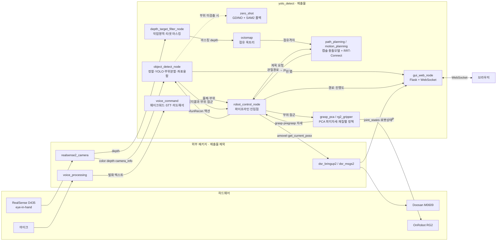
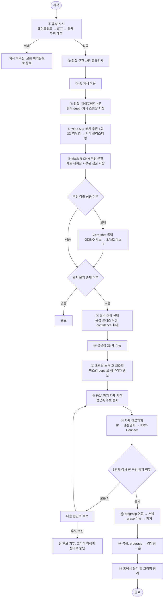

# 🛋️ 소파 밑 장난감 자율 탐색·회수 로봇 (ROS 2 Humble + YOLO11 + Mask R-CNN)

- 음성으로 지정한 장난감을 소파 하부처럼 한 면만 열린 좁은 공간에서 탐색·접근·파지·회수함
- 예시 지시: **"오리 몸통 집어와"**

---

## 📌 주요 기능 (Key Features)

### 1. 음성 명령 인식 (Voice Command)
- 웨이크워드 감지 → Whisper STT → gpt-4o 의도 해석의 3단계로 **"무엇의 어느 부위"** 를 확정함
- 키워드 파서를 이중화하여 네트워크 장애 시에도 발화 1회를 처리함
- 부위 미인식 시 로봇을 기동하지 않음

### 2. One-stage 신속 탐색 (YOLOv11)
- 고정 웨이포인트 5곳에서 컬러·depth·자세를 스냅샷으로 저장함
- 정찰 완료 후 5장에 대해 **배치 추론 1회**만 수행함
- depth는 정지 후 프레임들의 픽셀별 중앙값을 사용함
- 3D 역투영 → 거리 클러스터링 → confidence 가중평균으로 물체 좌표를 융합함
- 프레임 경계에 닿은 bbox는 깊이 왜곡이 발생하므로 좌표 계산에서 제외함

### 3. Two-stage 정밀 인식 (Mask R-CNN → SAM2)
- 부위 6클래스(head/body/arm/leg/cube/bag)를 분할하고 마스크 기준으로 좌표를 재계산함
- 부위 인스턴스를 겹치는 bbox에 귀속시켜 **물체별로 분리 계산·저장**함(`parts_obj_NNN.npz`)
- Mask R-CNN confidence 0.85 미만 인스턴스는 SAM2로 경계를 보정함
- 정찰 단계에서 부위 점군을 선확보하므로 회수 시 재촬영·재조준이 불필요함

### 4. Zero-shot 폴백 (Grounding DINO → SAM2)
- 학습 경로가 부위 검출에 실패한 물체에만 호출되는 예비 분할 경로임
- `the <부위> of the <물체>` 프롬프트로 박스를 획득하고 SAM2가 픽셀 마스크를 생성함
- 두 모델 모두 **첫 호출 시점 지연 로드**로 기본 경로에서는 자원을 점유하지 않음

### 5. Point Cloud → OctoMap 전환 (Occupancy Octree)
- 공간을 8분할 재귀 분할하고 칸마다 점유확률(log-odds)을 유지함, 해상도 **10mm**
- 중복 관측 시 점을 누적하지 않고 점유확률만 갱신하여 **자료량 상한을 고정**함
- **광선 추적 갱신**으로 센서–관측점 구간을 자유공간화하여 치워진 물체를 지도에서 제거함
- 동일 상태의 8형제 노드를 병합하고, 충돌 검사 시 **옥트리 하강**으로 빈 노드의 하위 전체를 배제함
- 목표 물체 중심 5cm 반경만 비장애물로 활성화함
- 생성된 점유격자를 **박스 5벽 모델과 함께** 등록함
- 계획 직전 옥트리를 소거하고 새 프레임으로 재축적함

### 6. MoveIt 자체 구현 (Motion Planning)
- 로봇을 링크 캡슐(선분 + 반지름)로 근사하고 정기구학으로 관절 자세마다 충돌을 판정함

  | 장애물 | 표현 | 판정 |
  |---|---|---|
  | 박스 5벽 | 방향성 직육면체(OBB) | 캡슐 반지름만큼 부풀린 뒤 슬랩 교차 |
  | 관측 환경 | 점유 옥트리 | 옥트리 하강 후 칸 상자와 교차 |
  | 로봇 자신 | 링크 캡슐 | 선분–선분 최단거리 < 두 반지름 합 |

- 자기충돌 검사 쌍을 무작위 자세 400개 샘플링으로 자동 도출함(13쌍)
- 관절공간 **RRT-Connect** 적용: 시작·목표 유효성 확인 → 직선 통과 시 채택 → 양방향 트리 확장
  → 무작위 shortcut 평활화 → 실행 단위 재분할
- 접근축 후보를 순회하며 후보마다 **5단계 순차 검사**를 수행함:
  파지 자세 충돌 → 사전파지 IK 해 → 현재→사전파지 경로계획 → 사전파지→파지 구간 → 파지→복귀 구간

### 7. PCA 기반 파지 자세 산출 (Grasp)
- 부위 점군의 제1주성분을 장축으로 보고 장축 수직 방향과 폭을 파지값으로 결정함
- 분산비(λ₁/λ₂)로 장축 신뢰도를 판정함(1.20 미만 중심연결축 / 이상 PCA 장축)
- 파지 위치와 장축 계산용 점군을 분리함(arm → body+arm, body·head·leg → head+body+leg)
- Tool X = 그리퍼 닫힘 방향, Tool Y = 장축, Tool Z = 접근 방향으로 좌표계를 구성함
- 재질별 파지력을 적용함(skin 5N / rubber 7N / plastic 10N)

### 8. HMI (Web Dashboard)
- Flask(8080)와 WebSocket(8765)을 한 프로세스에서 실행함
- `/` — 실시간 3D 씬 맵, 회수 경로, 로봇 상태, 정지·비상정지 버튼 제공
- `/photo_map` — 정찰 스냅샷을 ICP 정합한 고밀도 실사 3D 맵 제공
- 경로 표시 규칙 — 지나온 길: 파란 실선 / 남은 길: 빨간 점선 / 현재 이동점: 진행 방향 화살표

---

## 🛠️ 시스템 설계 (System Architecture)

### 전체 구조

- 인식 → 3D 처리 → 경로계획 → 로봇제어 → HMI의 **5계층**으로 구성함
- 각 계층은 ROS 2 토픽·액션으로만 연결되며, 계층 간 직접 호출이 없음

| 계층 | 구성 요소 | 입력 | 산출물 |
|---|---|---|---|
| 인식 (Perception) | `object_detect_node`, `zero_shot` | 컬러·depth 스냅샷 | 물체 좌표, 부위 점군(`parts_obj_NNN.npz`) |
| 3D 처리 (3D Processing) | `depth_target_filter_node`, `octomap` | 마스킹 depth 스트림 | 점유 옥트리(10mm) |
| 경로계획 (Planning) | `path_planning`, `motion_planning` | 점유 옥트리 + 박스 5벽 + 목표 자세 | 관절 경로 → `posx` 열 |
| 로봇제어 (Control) | `robot_control_node`, `grasp_pca`, `rg2_gripper` | 부위 점군, 계획 경로 | `amovel` 이동 명령, 그리퍼 개폐 |
| HMI | `gui_web_node`, `voice_command` | 발화, 맵·경로·로봇 상태 | 지시(물체·부위), 웹 대시보드 |

### 실행 구성 (프로세스)

| 프로세스 | 실행 명령 | 역할 |
|---|---|---|
| 정찰·탐지 노드 | `ros2 run yolo_detect object_detect_node` | `RunRecon` 액션 서버, 스냅샷·탐지·부위분할 |
| depth 마스킹 노드 | `ros2 run yolo_detect depth_target_filter_node` | 작업영역 밖·타겟 반경 제거 후 재발행 |
| 웹 노드 | `ros2 run yolo_detect gui_web_node` | Flask 8080 + WebSocket 8765, ROS 브리지 내장 |
| 진입점 | `ros2 run yolo_detect robot_control_node` | 파이프라인 전체 수행, 액션 클라이언트 겸 로봇 제어 |

### ROS 인터페이스

| 종류 | 이름 | 용도 |
|---|---|---|
| 액션 | `object_detect_node/run_recon` | 정찰 실행, 진행 피드백, 탐지 결과 반환 |
| 토픽 | `object_detect_node/snapshot_taken` | 웨이포인트별 촬영 완료 신호 |
| 토픽 | `object_detect_node/map_points` | 웹 3D 씬 맵 점군 |
| 토픽 | `object_detect_node/depth_filtered` | 마스킹된 depth, 옥트리 입력 |
| 토픽 | `yolo_detect/approach_path_viz`, `yolo_detect/approach_progress` | 웹 경로 표시와 진행도 |
| 서비스 | `/depth_target_filter_node/set_parameters` | 회수 대상 좌표·반경 설정 |
| 외부 | `/dsr01/aux_control/get_current_posx`, `motion/move_pause`, `system/servo_off` 등 | 두산 컨트롤러 제어·조회 |

### 구조도



### 소스 구성

| 파일 | 역할 |
|---|---|
| `yolo_detect/robot_control_node.py` | 실행 진입점, 정찰 → 접근 → 파지 → 복귀 전체 수행 |
| `yolo_detect/voice_command.py` | 웨이크워드 → STT → 의도 해석 |
| `scripts/build_octree_preview.py` | 스냅샷 기반 고밀도 실사 3D 맵 생성 |
| `yolo_detect/object_detect_node.py` | 정찰 스냅샷 수집, YOLO 배치 탐지, 부위 분할, 좌표 융합, 씬 맵 발행 |
| `yolo_detect/depth_target_filter_node.py` | 작업영역 밖·타겟 반경 depth 마스킹 |
| `yolo_detect/gui_web_node.py` | Flask + WebSocket, 맵·경로·로봇 상태 중계, 정지 명령 처리 |
| `yolo_detect/zero_shot.py` | Grounding DINO + SAM2 지연 로드, 부위 박스·마스크 생성 |
| `yolo_detect/octomap.py` | 점유 옥트리, 8분할 재귀·점유확률·광선추적·노드 병합·하강 질의 |
| `yolo_detect/path_planning.py` | 캡슐 충돌모델, 관절공간 RRT-Connect |
| `yolo_detect/motion_planning.py` | 박스벽·옥트리 등록, depth 스트림 반영, 경로계획, 구간 사전 충돌검사 |
| `yolo_detect/grasp_pca.py` | PCA 파지 자세(접근축·닫힘축·폭) 계산 |
| `yolo_detect/rg2_gripper.py` | RG2 Modbus 제어, 재질별 파지 정책 |
| `yolo_detect/transforms.py` | 역투영, 정기구학·수치 역기구학, 카메라 지향 자세 |
| `yolo_detect/config.py` | 좌표·임계값·토픽 이름 설정 |
| `yolo_detect_msgs/` | `RunRecon.action`, `Waypoint`·`DetectedObject`·`RawDetection` 메시지 |
| `resource/yolo_toy.pt` | YOLO11 학습 가중치(장난감 5종) |
| `resource/toy_part_maskrcnn.pth` | Mask R-CNN 학습 가중치(부위 6종) |
| `resource/hello_rokey_8332_32.tflite` | 웨이크워드 모델 |
| `resource/T_gripper2camera.npy` | 핸드아이 캘리브레이션 행렬 |
| `resource/.env` | OpenAI API 키(STT·의도 해석용) |
| `dataset_tools/` | 데이터셋 준비 스크립트, YOLO11 학습 노트북(Colab) |

## 🔀 알고리즘 플로우 차트 (Logic Flow)



---

## 💻 운영체제 환경 (Environment)

- **OS**: Ubuntu 22.04.5 LTS (Jammy Jellyfish)
- **Middleware**: ROS 2 Humble Hawksbill
- **Language**: Python 3.10.12
- **GPU**: CUDA 12.4 (torch 2.6.0+cu124)
- **Key Libraries**: `rclpy`, `ultralytics`(YOLO11), `detectron2`(Mask R-CNN),
  `transformers`(Grounding DINO·SAM2), `open3d`, `opencv-python`, `scipy`, `pymodbus`,
  `flask`, `websockets`

---

## 🔧 사용 장비 (Hardware Setup)

| 구성 | 모델 | 연결 / 사양 |
|---|---|---|
| 로봇 | Doosan M0609 (6축) | Ethernet `192.168.1.100:12345` |
| 카메라 | Intel RealSense D435 | USB, eye-in-hand(플랜지 장착), `aligned_depth_to_color` |
| 그리퍼 | OnRobot RG2 | Compute Box Modbus TCP `192.168.1.1:502`, 최대 개방 110mm |
| 마이크 | USB 마이크 | 48kHz 1ch |
| PC | Ubuntu 22.04 | i7-11370H / RAM 16GB / RTX 3050 Ti Laptop (VRAM 4GB) |
| 작업 공간 | 한 면만 열린 박스 | 로봇이 입구로 팔을 넣어 작업함 |

---

## 📦 의존성 설치 (Installation)

### 1. Python 필수 라이브러리 (`requirements.txt`)

```bash
pip install -r requirements.txt
```

### 2. Mask R-CNN (detectron2)

```bash
python3 -m pip install 'git+https://github.com/facebookresearch/detectron2.git'
```

### 3. ROS 2 패키지

```bash
sudo apt update
sudo apt install ros-humble-realsense2-camera ros-humble-cv-bridge \
                 ros-humble-tf2-ros ros-humble-rclpy
```

### 4. 외부 패키지 (제출물 미포함)

| 패키지 | 용도 |
|---|---|
| `doosan-robot2` (`dsr_bringup2`, `dsr_msgs2`, `DSR_ROBOT2`) | 로봇 브링업, `amovel`·`get_current_posx` |
| `voice_processing` | 웨이크워드 감지, Whisper STT (`--voice` 사용 시) |

### 5. OpenAI API 키

- 키는 `resource/.env`에 동봉되어 있어 별도 설정 없이 동작함
- 탐색 순서: 환경변수 `OPENAI_API_KEY` → `yolo_detect/resource/.env` → `voice_processing/resource/.env`
- 다른 키를 쓰려면 아래 중 하나를 적용함

```bash
export OPENAI_API_KEY=sk-...
# 또는
echo "OPENAI_API_KEY=sk-..." > src/yolo_detect/resource/.env
```

### 6. 빌드

```bash
cd ~/D_3_cobot2_ws
colcon build --packages-select yolo_detect_msgs yolo_detect
source install/setup.bash
```

---

## 🚀 실행 순서 (How to Run)

- 각 터미널에서 환경을 먼저 불러옴

```bash
source /opt/ros/humble/setup.bash && source ~/D_3_cobot2_ws/install/setup.bash
```

```bash
# 터미널 1 — 카메라
ros2 launch realsense2_camera rs_launch.py align_depth.enable:=true \
     spatial_filter.enable:=true temporal_filter.enable:=true

# 터미널 2 — 로봇 브링업
ros2 launch dsr_bringup2 dsr_bringup2_rviz.launch.py \
     mode:=real host:=192.168.1.100 port:=12345 model:=m0609

# 터미널 3 — 정찰·탐지 노드
ros2 run yolo_detect object_detect_node

# 터미널 4 — depth 마스킹 노드 (옥트리 입력)
ros2 run yolo_detect depth_target_filter_node

# 터미널 5 — 웹 대시보드 (터미널 6보다 먼저 실행)
ros2 run yolo_detect gui_web_node
#   http://localhost:8080            대시보드
#   http://localhost:8080/photo_map  고밀도 실사맵

# 터미널 6 — 실행 진입점
PYTHONUNBUFFERED=1 ros2 run yolo_detect robot_control_node --voice 2>&1 \
     | tee ~/run_$(date +%H%M).log
```

| 실행 옵션 | 동작 |
|---|---|
| `--voice` | 웨이크워드("Hello Rokey") 대기 후 발화로 물체·부위를 지정함 |
| `--part <부위>` | 음성 없이 부위를 직접 지정함 (`head`/`body`/`arm`/`leg`) |
