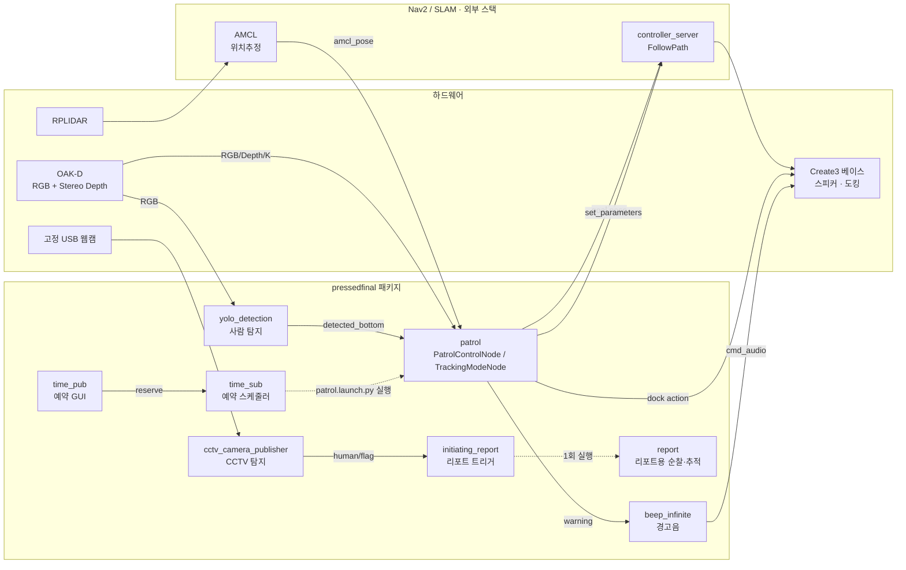
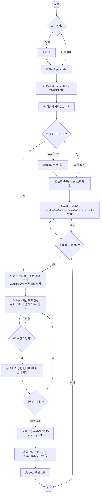

# 🌱 Green Guard — SLAM·Nav2 기반 스마트팜 순찰 로봇

- TurtleBot4가 스마트팜 내부를 자율 순찰하다가 사람이 감지되면 순찰을 멈추고 depth 카메라로 대상을 추적하며, 대상을 놓치면 제자리 탐색 후 도킹 스테이션으로 복귀함
- 예시 시나리오: **"순찰 중 침입자 발견 → 추적·경고음 → 시야 이탈 시 1바퀴 탐색 → 미발견 시 자동 귀환·도킹"**

---

## 프로젝트 개요

- **목표**: 고정형 CCTV의 감시 사각지대와 반복 순찰 인력 부담을 보완하기 위해, AMR이 waypoint 기반으로 자율 순찰하며 침입자·이상 상황을 감지·대응하는 보안 시스템 구현
- **주요 기능**: 고정 카메라 감시, AMR 자율 순찰·추적·귀환, YOLO 기반 사람 감지, 경고음 알림, 감지 이벤트 리포트 자동 트리거
- **사용 장비**: TurtleBot4(Create3), OAK-D 카메라, USB 웹캠(CCTV), RPLIDAR
- **개발 환경**: Ubuntu 22.04, ROS2 Humble, Nav2
- **주요 기술 스택**: ROS2, Nav2(AMCL·controller_server), YOLOv8(ultralytics), OpenCV, tf2, irobot_create_msgs
- **기간**: 2026.06.23 ~ 2026.07.14
- **담당 범위**: 이 저장소(`pressedfinal` 패키지)는 팀 프로젝트 중 **AMR 순찰·추적·귀환 및 알림** 파트를 다룸 (Web UI/DB 등 다른 계층은 팀의 별도 저장소에서 관리)

## 시연 영상

https://github.com/user-attachments/assets/07690226-8a90-406d-bcf1-c45918c75e2c

---

## 📌 주요 기능 (Key Features)

### 1. 자율 순찰 (Patrol / Nav2 Waypoint)
- `/robot3/amcl_pose`를 `TRANSIENT_LOCAL` QoS로 구독해 최초 pose를 즉시 확보함
- 맵 상에 7개 waypoint(`point1~5`, `point24_mid`, `point35_mid`)를 좌표+방향(`TurtleBot4Directions`)으로 정의함
- 시작 시 현재 위치에서 **가장 가까운 지점**을 계산해 먼저 이동하고, `point1`이면 `point2`를 한 번 더 거친 뒤 순찰 루프에 진입함
- 루프 순서: `point2 → point3 → point35_mid → point24_mid → point35_mid → point5 → point4 → (반복)`
- `controller_server/set_parameters` 서비스로 이동 상황에 따라 속도 프로파일을 전환함 (평상시 `0.30 m/s` / 순찰 구간 `0.15 m/s`, 각속도 `1.00 rad/s` 고정)
- 시작 전 도킹 상태를 확인해 도킹 중이면 자동 undock

### 2. 사람 탐지 (YOLO Detection)
- 로봇 OAK-D의 RGB 압축 영상(`/robot3/oakd/rgb/image_raw/compressed`)을 YOLOv8n(coco pretrained)으로 추론함
- `person`(class id `0`) 중 confidence `0.8` 이상만 채택하고, 여러 명이 잡히면 **바운딩박스 하단(y2)이 가장 큰**(카메라에 가장 가까운) 대상 하나만 선택함
- 오탐 방지를 위해 **연속 0.5초 이상** 탐지되어야 `is_detected`를 확정함
- 대상의 바닥 접점 픽셀 좌표 `((x1+x2)/2, y2)`를 `/robot3/detected_bottom`으로 발행, 미탐지 시 `(-1, -1)` 발행

### 3. 추적 모드 (Tracking)
- 순찰 중 탐지가 확정되면 즉시 `cancelTask()` + 강제 정지 후 별도 `TrackingModeNode`로 전환함 (TF 안정화를 위해 5초 대기 후 시작)
- 카메라 intrinsics(`K`)로 바닥 픽셀을 카메라 좌표계로 역투영하고, depth 값(mm→m)을 이용해 3D 좌표를 계산한 뒤 `tf2`로 `map` 프레임으로 변환해 goal pose를 생성함
- depth 유효 범위(`0.2m ~ 5.0m`) 밖의 값은 무시함
- 대상이 `STOP_DISTANCE(0.4m)` 이내로 들어오면 `follow_mode`로 전환해 goal을 계속 갱신하며 근접 추종하고, 그 이내에서는 정지 상태를 유지함
- OpenCV 창(RGB+Depth 좌우 합성)에 goal 전송 여부·거리·탐색 상태 등을 실시간 오버레이함 (`q` 입력 시 즉시 종료 가능)

### 4. 탐색(Search) 및 자동 귀환(Gohome)
- 대상을 `LOST_DETECT_SECONDS(1.0초)` 이상 놓치면, 마지막으로 보였던 위치가 화면 중심 기준 좌/우 어느 쪽인지에 따라 반대 방향으로 회전 탐색을 시작함 (`SEARCH_ANGULAR_SPEED 0.2 rad/s`)
- 탐색 중 재감지되면 즉시 추적을 재개하고, `SEARCH_TURNS(1바퀴, 2π)`를 다 돌아도 못 찾으면 추적을 종료(`GOHOME`)함
- Gohome은 현재 위치에서 가장 가까운 경유지를 찾은 뒤, 사전에 정의한 `route_table`(예: `5 → 3 → 2 → 1 → 0`)을 따라 순차 이동하고, 도킹 스테이션 근처(`point 0`)에서 `Dock` 액션을 호출해 자동 도킹함

### 5. 경고음 (Warning Beep)
- `/robot3/warning`(Bool)을 구독해 `True`가 들어오는 동안 `0.5초` 주기로 Create3 스피커에 `784Hz`/`523Hz`를 번갈아 재생하는 삐뽀 경고음을 발행함
- 마지막 `True` 수신 후 `1.0초`(`WARNING_TIMEOUT`) 동안 갱신이 없으면 자동으로 OFF 처리해 경고음이 끊기지 않고 안전하게 종료됨
- 구독자가 없는 스피커 토픽에는 발행하지 않아 불필요한 트래픽을 줄임

### 6. CCTV 사람 탐지 → 리포트 자동 트리거
- 로봇과 별개로 고정 USB 웹캠(`cv2.VideoCapture(2)`, 640x480@30fps)에서 `0.3초` 주기로 YOLOv8n을 돌려 `person`(conf ≥ `0.7`)을 탐지함
- 탐지 결과 바운딩박스가 그려진 영상은 `/detection/cctv/human`으로, 탐지 여부는 `/detection/cctv/human/flag`(Bool)로 발행함
- `initiating_report` 노드가 플래그가 `True`로 처음 올라오는 순간을 감지해 **1회성으로** `report.launch.py`를 서브프로세스로 실행한 뒤 스스로 종료함 (`beep_infinite` + `yolo_detection` + `report`, 로봇이 추가로 순찰·추적을 수행하는 리포트 전용 흐름)

### 7. 예약 순찰 (Reserve)
- Tkinter GUI(`time_pub`)에서 반복 간격(시/분, `HH:MM`)을 입력하면 `/robot3/reserve`로 발행함 (0시간 0분은 입력 검증에서 차단)
- `time_sub`가 간격 문자열을 파싱해 다음 실행 시각을 계산하고 `/robot3/reserve_time`으로 재발행하며, 갱신될 때마다 `patrol.launch.py`를 서브프로세스로 실행함 (이미 실행 중이면 `poll()`로 중복 실행을 방지)

---

## 🛠️ 시스템 설계 (System Architecture)

### 전체 구조

- 인식 → 위치추정 → 미션 제어 → 로봇 제어 → 알림/기록의 **5계층**으로 구성함
- 계층 간에는 ROS2 토픽·서비스·액션으로만 연결되며 직접 호출이 없음

| 계층 | 구성 요소 | 입력 | 산출물 |
|---|---|---|---|
| 인식 (Perception) | `yolo_detection.py`, `cctv_camera_publisher.py` | 로봇/CCTV 카메라 영상 | 사람 바닥 좌표(`detected_bottom`), CCTV 탐지 플래그 |
| 위치추정 (SLAM/Localization) | Nav2 AMCL (외부 스택) | LiDAR, 사전 맵 | 로봇 pose(`amcl_pose`) |
| 미션 제어 (Mission Control) | `patrol.py`의 `PatrolControlNode` / `TrackingModeNode` | pose, 탐지 좌표, RGB/Depth/camera_info | 순찰 진행, 추적 goal pose, 경고 상태 |
| 로봇 제어 (Robot Control) | Nav2 `controller_server`, `Dock` 액션, `cmd_vel` | goal pose, 속도 파라미터 | 이동·정지·회전·도킹 |
| 알림/기록 (Notify) | `beep_infinite.py`, `initiating_report.py`, `time_pub.py`/`time_sub.py` | warning 상태, CCTV 플래그, 예약 간격 | 경고음 재생, 리포트 launch 트리거, 순찰 자동 실행 |

### 실행 구성 (프로세스)

| 프로세스 | 실행 명령 | 역할 |
|---|---|---|
| 경고음 | `ros2 run pressedfinal beep_infinite` | 경고 상태 구독 후 스피커 재생/정지 |
| 사람 탐지 | `ros2 run pressedfinal yolo_detection` | 로봇 카메라 기반 사람 탐지 |
| 순찰·추적·귀환 진입점 | `ros2 run pressedfinal patrol` | AMCL 기반 순찰 → 추적 전환 → 탐색 → 귀환·도킹 전체 파이프라인 |
| CCTV 탐지 | `ros2 run pressedfinal cctv_camera_publisher` | 고정 웹캠 기반 사람 탐지 |
| 리포트 트리거 | `ros2 run pressedfinal initiating_report` | CCTV 플래그 수신 시 리포트 launch 1회 실행 |
| 리포트 로직 | `ros2 run pressedfinal report` | 리포트 launch에 포함되는 순찰/추적 로직 |
| 예약 입력 UI | `ros2 run pressedfinal time_pub` | Tkinter GUI로 반복 간격 발행 |
| 예약 스케줄러 | `ros2 run pressedfinal time_sub` | 간격 파싱, 다음 실행 시각 계산, 순찰 launch 자동 실행 |

### ROS 인터페이스 (네임스페이스: `/robot3`)

| 종류 | 이름 | 용도 |
|---|---|---|
| 액션 | `dock` (`irobot_create_msgs/Dock`) | 도킹 스테이션 복귀 |
| 서비스 | `controller_server/set_parameters` | Nav2 `FollowPath` 순찰/평상 속도 전환 |
| 토픽 | `amcl_pose` | 현재 로봇 pose (AMCL) |
| 토픽 | `detected_bottom` | YOLO가 탐지한 사람의 바닥 접점 좌표 (`-1,-1`이면 미탐지) |
| 토픽 | `cmd_vel` | 강제 정지·회전 탐색용 속도 명령 |
| 토픽 | `warning` | 사람 감지 경고 상태 (Bool) |
| 토픽 | `cmd_audio` | Create3 스피커 음계 (`AudioNoteVector`) |
| 토픽 | `oakd/rgb/image_raw/compressed`, `oakd/stereo/image_raw/compressedDepth`, `oakd/rgb/camera_info` | 로봇 카메라 RGB/Depth/내부 파라미터 |
| 토픽 (전역) | `/detection/cctv/human`, `/detection/cctv/human/flag` | CCTV 웹캠 탐지 이미지·플래그 |
| 토픽 (전역) | `/reserve`, `/reserve_time` | 예약 순찰 간격, 다음 실행 시각 |

### 구조도



### 소스 구성

| 파일 | 역할 |
|---|---|
| `pressedfinal/patrol.py` | 실행 진입점. AMCL 순찰 → 사람 감지 시 추적 전환 → 탐색 → 귀환·도킹까지 전체 상태 머신 수행 |
| `pressedfinal/yolo_detection.py` | 로봇 카메라 기반 YOLOv8n 사람 탐지, 바닥 좌표 발행 |
| `pressedfinal/beep_infinite.py` | 경고 상태 구독, Create3 스피커 경고음 재생/자동 종료 |
| `pressedfinal/cctv_camera_publisher.py` | 고정 웹캠 기반 YOLOv8n 사람 탐지, 결과 이미지·플래그 발행 |
| `pressedfinal/initiating_report.py` | CCTV 탐지 플래그 감지 시 `report.launch.py` 1회 실행 후 자체 종료 |
| `pressedfinal/report.py` | 리포트 launch에 포함되는 순찰/추적 로직 (`patrol.py`와 유사 구성) |
| `pressedfinal/time_pub.py` | Tkinter GUI, 순찰 반복 간격(`HH:MM`) 입력·발행 |
| `pressedfinal/time_sub.py` | 반복 간격 구독, 다음 실행 시각 계산, 순찰 launch 자동 실행 |
| `launch/patrol.launch.py` | `beep_infinite` + `yolo_detection` + `patrol` |
| `launch/report.launch.py` | `beep_infinite` + `yolo_detection` + `report` |
| `launch/start_report.launch.py` | `cctv_camera_publisher` + `initiating_report` |

---

## 🔀 알고리즘 플로우 차트 (`patrol.py` main 로직)



---

## 💻 운영체제 환경 (Environment)

- **OS**: Ubuntu 22.04 (TurtleBot4 표준 이미지)
- **Middleware**: ROS2 Humble
- **Language**: Python 3.10
- **Key Libraries**: `rclpy`, `ultralytics`(YOLOv8n), `opencv-python`, `numpy`, `tf2_ros`/`tf2_geometry_msgs`, `turtlebot4_navigation`, `nav2_simple_commander`, `irobot_create_msgs`, `cv_bridge`(CCTV 노드)

## 🔧 사용 장비 (Hardware Setup)

| 구성 | 모델 | 비고 |
|---|---|---|
| 로봇 | TurtleBot4 (iRobot Create3 베이스) | 도킹 스테이션 자동 복귀 지원 |
| 로봇 카메라 | OAK-D | RGB + Stereo Depth, `/robot3/oakd/*` |
| 라이다 | RPLIDAR (TurtleBot4 표준) | AMCL/SLAM 입력 |
| CCTV 카메라 | USB 웹캠 (index 2) | 640x480 @ 30fps 고정 설치 |
| 스피커 | Create3 내장 스피커 | `AudioNoteVector` 경고음 |

## 📦 의존성 설치 (Installation)

```bash
# ROS2 워크스페이스 빌드
colcon build --packages-select pressedfinal
source install/setup.bash

# Python 라이브러리
pip install ultralytics opencv-python numpy
```

- YOLOv8n 가중치(`yolov8n.pt`)는 `ultralytics` 최초 실행 시 자동 다운로드됨
- TurtleBot4 Nav2/SLAM 스택(`turtlebot4_navigation`, `nav2_simple_commander`, `irobot_create_msgs`)은 TurtleBot4 표준 설치를 따름

## 🚀 실행 순서 (How to Run)

```bash
# 터미널 1 — TurtleBot4 Nav2 + AMCL (기존 맵으로 로컬라이제이션 실행 중이어야 함)
ros2 launch turtlebot4_navigation localization.launch.py map:=<맵 경로>
ros2 launch turtlebot4_navigation nav2.launch.py

# 터미널 2 — 순찰 + 사람 탐지 + 경고음
ros2 launch pressedfinal patrol.launch.py

# 터미널 3 (선택) — CCTV 사람 탐지 → 리포트 자동 실행 대기
ros2 launch pressedfinal start_report.launch.py

# 터미널 4/5 (선택) — 예약 순찰
ros2 run pressedfinal time_pub
ros2 run pressedfinal time_sub
```

---

## 프로젝트 기여자

- 방현식 (문서 / 시스템 설계도)
- 김찬혁 (시스템 모니터 / Web UI·DB)
- 황재문 (AI Detection / 객체 탐지 검증)
- 유상우 (AMR 제어 / 노드 구성 — 본 저장소 담당)
- 멘토: Andy Kim

## 참고자료

- https://github.com/turtlebot/turtlebot4
- https://docs.nav2.org/
- https://github.com/ultralytics/ultralytics
